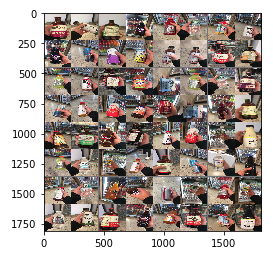
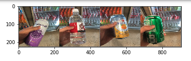

The cafenet image set contains 50447 RGB images of the items sold in the Cornell Tech cafe. These images were used to train the model used to recognize items in my github project [Popout](https://github.com/JordanMLee/popout) --autonomous checkout for campus dining.

There are 65 classes in total, so roughly 1000 images per class.

